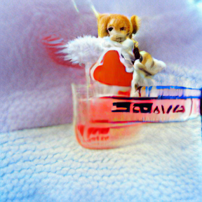
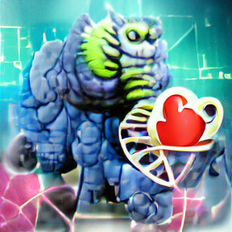

= Fantasy Cards
:toc:

== Introduction

Fantasy Cards is a card game, inspired by the card game "Fantasia(TM)".


== Demo

=== Current Demo

.card demo link:
https://mesw.github.io/fantasycards/build/FantasyCards.html

NOTE: There is still some fuzzyness around the property names. Some property names diverge from the naming in this document.


=== Past Demos

.webassembly demo link:
https://mesw.github.io/fantasycards/build/wasm-test.html


== Card Layout

.Layout of the card, with image on top and stats in table in bottom.
image::images/card-layout.drawio.png[]

The image on top is dynamically generated based on the stats.


== Stats

There are five basic stats.

.Sub-Stats
image::images/skill-set.drawio.png[]

The five basic stats are subdivided into two stats each.


.The basic stats are calculated based on the sub-stats.
```
TBD
e.g.
core-stat = abs(substatA - substatB)

C = A + B - abs(subA - subB)/2
```

== Image

The image is prerendered and chosen based on what stat is dominant.


=== Additional Random Parameters

There are additional random parameters that change how the player looks.
The random parameters have no effect on the stats and are not influenced by them.


=== Examples

.Here are some happy examples that were all created with the same property dominances:
* Strength
* Love
* Brave
* Science
* Cute


.Angel

.Ghost

.Man

.Monster

.Tree

.Water

.Woman

.Zombie


NOTE: the look and feel as well as the types of characters may change.

== Game Mechanics

plantuml::images/round-activities.puml[]


=== Progress
The player moves through a world of cards, that can be challenged. Sometimes the player is challenged as well.

