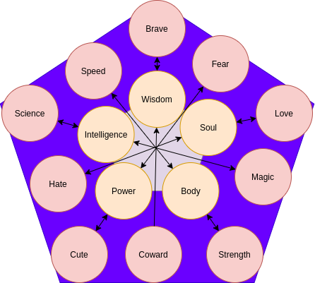

= Fantasy Cards

== Card Layout

.Layout of the card, with image on top and stats in table in bottom.
image::images/card-layout.drawio.png[]

The image on top is dynamically generated based on the stats.


== Stats

There are five basic stats.

.Sub-Stats


The five basic stats are subdivided into two stats each.

.List of all stats and sub-stats.
|===
|Basic-Stat|Substat 1|Substat 2

|Body
|Strength
|Speed

|Soul
|Love
|Hate

|Personality
|Braveness
|Cowardness

|Intelligence
|Scientific
|Magic

|Power
|Kindness
|Feared
|===


.The basic stats are calculated based on the sub-stats.
```
e.g.
body = (strength + power)/2
```

== Image

The image is generated dynamically based on the stats.
There are many images and combinations,
so it should be difficult to get the same card more than once.

=== Layout

The image consists of many small images that can be combined in any combination.

.Principal Layout


.Alternative Layouts
* Da Vinci's David like Wheel
* ...


=== Artwork

The artwork is based on the stats.
The higher the stat, the more extreme the depiction in the image.


When the two substats are balanced, the image shifts to a third way of expression to symbolize equilibrium.


=== Body
.Strengh and Speed


=== Soul
.Love and Hate


=== Personality
.Braveness and Cowardness


=== Intelligence
.Scientific and Magic


=== Power
.Kindness and Feared


=== Additional Random Parameters

There are additional random parameters that change how the player looks.
The random parameters have no effect on the stats and are not influenced by them.

.Random Parameters just for optical variation
* Player and Compagion
** Age
** Sex
** Skin color
** Hair color
** Hair style
** Eye shape
** Mouth shape
** Size
** Proportions
* Items
** color
** wear and tear
** effects


== Game Mechanics

The attacker chooses the stat. The defender chooses the sub-stat.
Both battles are averaged and the winner is chosen based on who has the higher stat.

=== Leveling Cards
The winner gains points, the loser loses points. If the stat is zero, the card is lost entirely.

=== Gaining Cards
The winner can choose if he gets the card, or gains points on the winning card.

=== Progress
The player moves through a world of cards, that can be challenged. Sometimes the player is challenged as well.

